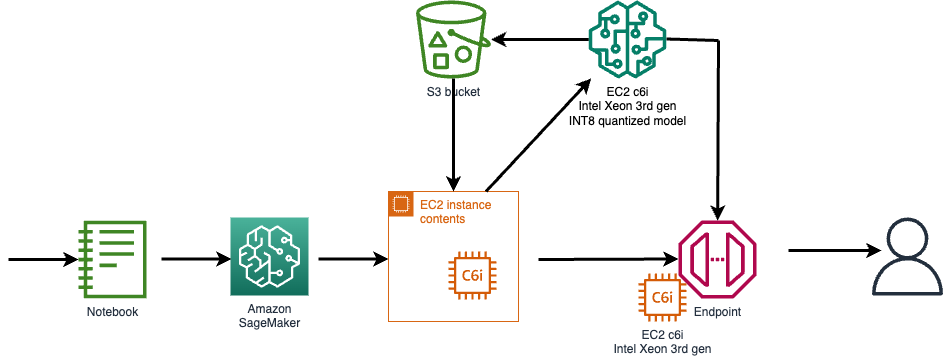

# Accelerate Amazon SageMaker inference with 3rd and 4th Gen Intel® Xeon® Scalable Processors

TODO: move docker and build files to bert_flask and check whether it works

## Overview
Boost the performance of your ML inference workloads on Amazon SageMaker using Intel-based EC2 instances (C6i). By leveraging Intel's INT8 inference deployment, you can achieve up to 4x performance improvement per dollar spent while maintaining inference accuracy.

## Table of Contents
1. [Technology Highlights](#technology-highlights)
2. [Available Intel Xeon-based EC2 Instances](#available-intel-xeon-based-ec2-instances)
3. [Prerequisites](#prerequisites)
4. [Usage](#usage)
5. [Available examples](#available-examples)
    1. [BertFlask](#bert-flask)
    2. [Codegen](#codegen)
6. [Security](#security)
7. [License](#license)

## Technology Highlights
* Amazon EC2 C7i instances utilize 3rd generation Intel Xeon Scalable processors (Ice Lake) with enhanced performance capabilities. These instances support both FP32, BF16 and INT8 model deployments, offering significant performance advantages.
* Amazon EC2 C6i instances utilize 3rd generation Intel Xeon Scalable processors (Ice Lake) with enhanced performance capabilities. These instances support both FP32 and INT8 model deployments, offering significant performance advantages.
* Integrate deep learning models seamlessly with SageMaker endpoints for efficient real-time inference.

## Available Intel Xeon-based EC2 Instances
Amazon EC2 offers a range of Intel Xeon-based instances suitable for various workloads:

* *C7i Instances*: Powered by 4th generation Intel Xeon Scalable processors, C7i instances contain Intel® Advanced Matrix Extensions(AMX) and combined with other extensions(AVX512, AVX512 VNNI) are even more optimized for AI/ML workloads than their predecessors. Read more about C7i instances: https://aws.amazon.com/ec2/instance-types/c7i/
* *C6i Instances*: Powered by 3rd generation Intel Xeon Scalable processors, C6i instances are optimized for AI/ML workloads and thanks to containing AVX-512 and AVX-512 Vector Neural Network Instructions (VNNI) extensions offer excellent performance for deep learning inference tasks. Read more about C6i instances: https://aws.amazon.com/ec2/instance-types/c6i/
* *Other Intel Xeon Instances*: In addition to C7i and C6i instances, EC2 provides various other instance types featuring Intel Xeon processors, such as C5, M6i, and R6i instances. Each instance type is tailored to different use cases and offers distinct combinations of compute, memory, and networking resources.

## Prerequisites
TODO: add more descriptive information about prerequisites
In order to successfuly run the examples to need to ensure that you have access to the following:
* Linux shell terminal with AWS CLI installed.
* AWS account with access to EC2 (C6i instance type) instance creation.
* SageMaker access for model deployment.
* IAM access for configuring roles and policies.
* Access to Elastic Container Registry (ECR).
* S3 bucket for uploading models and code.

## Usage
1. **Launch EC2 instance**: Create an EC2 instance with C6i instance type and Ubuntu 20.04 Linux AMI.
2. **Setup environment**: SSH into the EC2 instance and install Docker and AWS CLI.
3. **Build Docker image**: Use provided scripts to build a Docker image for quantization and model generation.
4. **Push Docker image to ECR**: Push the docker image in the container registry for SageMaker to access it.
5. **Generate models**: Execute Python scripts to generate FP32 and INT8 models within the Docker container.
6. **Upload models**: Upload the generated model artifacts to an S3 bucket.
7. **Create SageMaker model and endpoint**: Register the model and configure the endpoint in SageMaker.
8. **Test inference**: Execute provided Python scripts to test both FP32 and INT8 models.
9. **Cleanup**: Ensure to shut down and clean up all created resources and artifacts.

## Available examples

### Bert Flask

See [add link] for more information.

### Codegen

See [add link] for more information.

## Security

See [CONTRIBUTING](CONTRIBUTING.md#security-issue-notifications) for more information.

## License

This library is licensed under the MIT-0 License. See the LICENSE file.
